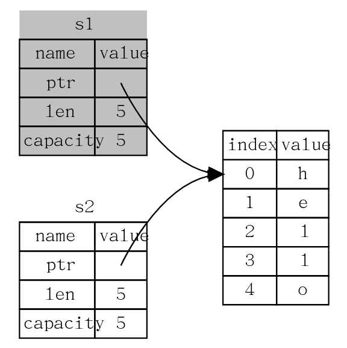
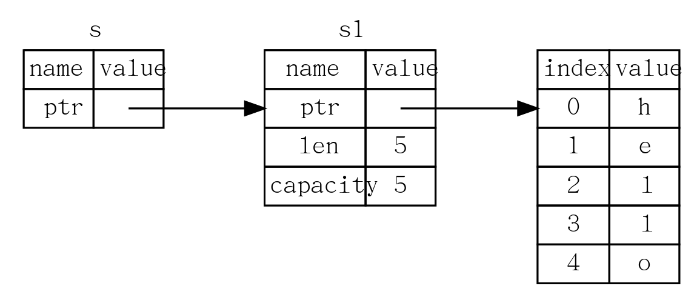
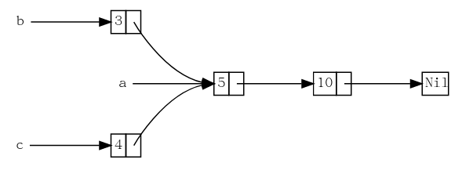

## Ch0 安装Rust

- 使用rustup安装

  ```bash
  curl --proto '=https' --tlsv1.2 -sSf https://sh.rustup.rs | sh
  ```

- 安装时出现的问题（~~未完全~~解决）：默认`.cargo`环境变量设置为了`/home/<username>/~/.cargo`，导致在用户家目录下又新建了`~`目录，在安装完rust后，将`.cargo`目录移动到`~/`家目录下，并修改所有可能会更改环境变量的文件，包括`~/.profile`、`/etc/profile`、`/etc/bash.bashrc`、`~/.cargo/env`，将其中的`/home/<username>/~/.cargo`改为`~/.cargo`。但是每当打开终端时，环境变量PATH还是会自动添加`/home/<username>/~/.cargo/bin`

  - ~~暂时的~~解决方案：在`~/.bashrc`文件中添加语句，覆盖错误的环境变量(重启后就成功了)

    ```bash
    export PATH=~/.cargo/bin:$PATH
    ```

## Ch1 Cargo

### 1.1 使用Cargo创建项目

- 创建hello_world目录，并在其中新建二进制项目hello_world

  ```bash
  $ cargo new hello_world
  ```

- 创建库项目

  ```bash
  $ cargo new hello_world --lib
  ```


#### 1.1.1 Cargo.toml

Cargo.toml是项目的配置文件，通过cargo new自动生成

```toml
[package]
name = "hello_world"
version = "0.1.0"
authors = ["Your Name <you@example.com>"]
edition = "2018"

[dependencies]
```

- [package]片段：配置一个包，包含项目名称、版本、作者和Rust版本
- [dependencies]片段：罗列项目依赖

#### 1.1.2 源代码目录src

包含main.rs以及其他源文件

### 1.2 构建并运行Cargo项目

**编译项目**

```bash
$ cargo build
```

**编译并运行项目**

```bash
$ cargo run
```

**快速检查代码确保其可以编译，但不生成可执行文件**

```bash
$ cargo check
```

以上命令会生成以下文件：

#### 1.2.1 可执行文件

存放目录为`./target/debug/hello_world`

#### 1.2.2 Cargo.lock

Cargo.lock记录项目依赖的实际版本，确保项目构建是可重现的，这个文件不需要人为修改

### 1.3 发布(release)构建

当项目最终准备好发布时，可以优化编译项目是的Rust代码运行更快

```bash
$ cargo build --release
```

此时生成的可执行文件在`./target/release/`目录下

## Ch2 引入 - guess_number

### 2.1 创建变量

```rust
let mut guess = String::new();
```

- `let` 创建变量，变量默认不可变
- `mut` 使得变量可变
- `::` 表明new是`String`类型的一个关联函数

### 2.2 从标准输入读取

```rust
use std::io;

io::stdin().read_line(&mut guess).expect("Failed to read line");
```

- `io::stdin`函数返回一个终端标准输入句柄
- `read_line`将标准输入存入字符串
- `&`表示这个参数是一个引用
- `read_line`函数返回一个`Result`类型（枚举），成员有`Ok`和`Err`
- `Result`实例有`expect`方法：
  - 若`Result`值为`Ok`，`expect`获取`Ok`中的值并原样返回
  - 若`Result`值为`Err`，`expect`导致程序崩溃，并显式当做参数传给`expect`的信息

### 2.3 crate

crate是一个Rust代码包

- 我们构建的项目是一个**二进制crate**
- rand crate是一个**库crate**

#### 2.3.1 导入外部crate

以rand crate为例

- 在使用rand编写代码之前需要修改`Cargo.toml`文件

  ```toml
  [dependencies]
  
  rand = "0.5.5"
  ```

- 再进行`cargo build`，此时会从Crates.io拷贝数据并下载对应的库文件，需要更换国内镜像源进行加速，编辑`.cargo/config`文件，加入以下内容

  ```
  [source.crates-io]
  registry = "https://github.com/rust-lang/crates.io-index"
  replace-with = 'ustc'
  [source.ustc]
  registry = "git://mirrors.ustc.edu.cn/crates.io-index"
  ```

#### 2.3.2 更新crate

```bash
$ cargo update
```

#### 2.3.3 获取所有本地依赖提供的文档

查看应该 `use`哪个`trait`以及该从`crate`中调用哪个方法

```bash
$ cargo doc --open
```

## Ch3 常见编程概念

### 3.1 变量和可变性

- 使用`let`声明的变量默认是不可改变的

  ```rust
  let x = 3;
  x = 5;   // 非法
  ```

- 在变量名之前加`mut`来使其可变

  ```rust
  let mut x = 3;
  x = 5;   // 合法
  ```

#### 3.1.1 变量和常量的区别

- 常量使用关键字`const`声明，并且必须**注明值的类型**
- 不能对常量使用`mut`

- 常量只能被设置为常量表达式，而不能是函数调用的结果

#### 3.1.2 隐藏

- 定义一个与之前变量同名的新变量，而新变量会**隐藏**之前的变量

  ```rust
  let x = 5;
  let x = x + 1;
  ```

- 当再次使用`let`时，实际上创建了一个新变量，我们可以改变值的类型，但复用这个名字

### 3.2 数据类型

Rust 是 **静态类型**语言，在编译时就必须知道所有变量的类型

#### 3.2.1 标量类型

- **标量**类型代表一个单独的值

##### 整型

| 长度    | 有符号  | 无符号  |
| ------- | ------- | ------- |
| 8-bit   | `i8`    | `u8`    |
| 16-bit  | `i16`   | `u16`   |
| 32-bit  | `i32`   | `u32`   |
| 64-bit  | `i64`   | `u64`   |
| 128-bit | `i128`  | `u128`  |
| arch    | `isize` | `usize` |

| 数字字面值       | 例子          |
| ---------------- | ------------- |
| Decimal          | `98_222`      |
| Hex              | `0xff`        |
| Octal            | `0o77`        |
| Binary           | `0b1111_0000` |
| Byte (`u8` only) | `b'A'`        |

##### 浮点型

- Rust 的浮点数类型是 `f32` 和 `f64`，分别占 32 位和 64 位

- 默认类型是 `f64`

##### 布尔型

- `bool`，两个可能的值`true`和`false`

##### 字符类型

- `char` 类型的大小为四个字节，并代表了一个 Unicode 标量值

#### 3.2.2 复合类型

##### 元组类型

- 元组长度固定：一旦声明，其长度不会增大或缩小

- 元组中的每一个位置都有一个类型，而且这些不同值的类型也不必是相同的

```rust
let tup: (i32, f64, u8) = (500, 6.4, 1);

let (x, y, z) = tup;   // 解构

let five_hundred = tup.0;   // 使用索引访问
```

##### 数组类型

- 数组中的每个元素的类型必须相同
- Rust 中的数组是固定长度的：一旦声明，它们的长度不能增长或缩小

```rust
let a = [1, 2, 3, 4, 5];

let a: [i32; 5] = [1, 2, 3, 4, 5];

let b = [0; 10];   // 初始化一个长度为10的全零数组

let first = a[0];   // 使用索引访问
```

### 3.3 函数

- `fn` 关键字声明新函数

- 在函数签名中，**必须**声明每个参数的类型

  ```rust
  fn another_function(x: i32, y: i32) {
      println!("The value of x is: {}", x);
      println!("The value of y is: {}", y);
  }
  ```

#### 3.3.1 具有返回值的函数

- 以表达式结尾

  ```rust
  fn plus_one(x: i32) -> i32 {
      x + 1
  }
  ```

### 3.4 注释

- // 单行注释

### 3.5 控制流

#### 3.5.1 if表达式

```rust
if number % 4 == 0 {
    println!("number is divisible by 4");
} else if number % 3 == 0 {
    println!("number is divisible by 3");
} else if number % 2 == 0 {
    println!("number is divisible by 2");
} else {
    println!("number is not divisible by 4, 3, or 2");
}
```

- Rust 不会尝试自动地将非布尔值转换为布尔值，所以`if`后跟的表达式必须是`bool`

##### 在let语句中使用if

```rust
let number = if condition {
    5
} else {
    6
};
```

- 代码块的值是其最后一个表达式的值
- `if`和`else`中返回的类型要相同

#### 3.5.2 循环

##### loop

- 无限循环，直到按下ctrl+c，或有break

##### while

```rust
let mut number = 3;
while number != 0 {
    println!("{}!", number);
    number = number - 1;
}
```

##### for遍历集合

```rust
let a = [10, 20, 30, 40, 50];

for element in a.iter() {
    println!("the value is: {}", element);
}
```

## Ch4 所有权

### 4.1 什么是所有权

- Rust管理内存的方式：通过所有权系统管理内存，编译器在编译时会根据一系列的规则进行检查

#### 4.1.1 所有权规则：

> 1. Rust 中的每一个值都有一个被称为其 **所有者**（*owner*）的变量。
> 2. 值有且只有一个所有者。
> 3. 当所有者（变量）离开作用域，这个值将被丢弃。

#### 4.1.2 变量作用域

```rust
{                      // s 在这里无效, 它尚未声明
    let s = "hello";   // 从此处起，s 是有效的

    // 使用 s
}                      // 此作用域已结束，s 不再有效
```

#### 4.1.3 String类型

- 字符串的字面值是不可变的，而`String`类型的字符串是可变的
- `String`类型的字符串被分配到**堆**上，所以能够存储在编译时未知大小的文本

```rust
// 基于字符串字面值来创建String
let s = String::from("hello");
```

#### 4.1.4 内存与分配

对于`String`类型，为了支持一个可变，可增长的文本片段，需要在堆上分配一块在编译时未知大小的内存来存放内容。这意味着：

- 必须在运行时向操作系统请求内存
- 需要一个当我们处理完`String`时将内存返回给操作系统的方法

Rust处理第二点的策略：内存在拥有它的变量离开作用域后就被自动释放

#### 4.1.5 存储在堆上的变量

##### 1. 移动

```rust
let s1 = String::from("hello");
let s2 = s1;
```



`String` 由三部分组成，如上图所示：一个指向存放字符串内容内存的指针，一个长度，和一个容量。

当 `s2` 和 `s1` 离开作用域，他们都会尝试释放相同的内存。这是一个叫做**二次释放**的错误，两次释放（相同）内存会导致内存污染，它可能会导致潜在的安全漏洞。

在Rust中，经过以上语句，会认为s1不再有效，即`s1` 被**移动**到了 `s2` 中，因此当`s1`离开作用域时不会释放内存。

##### 克隆

```rust
let s1 = String::from("hello");
let s2 = s1.clone();
```

`s2`深度复制了`s1`堆上的内容，而不仅仅是栈上的指针。

- 以上只针对存储在堆上的类型，而对于类似整型等存储在栈上的类型，可以直接拷贝，变量值不会被移动

#### 4.1.6 所有权与函数

```rust
fn main() {
    let s1 = gives_ownership();         // gives_ownership 将返回值移给 s1

    let s2 = String::from("hello");     // s2 进入作用域

    let s3 = takes_and_gives_back(s2);  // s2 被移动到
                                        // takes_and_gives_back 中, 
                                        // 它也将返回值移给 s3
} // 这里, s3 移出作用域并被丢弃。s2 也移出作用域，但已被移走，
  // 所以什么也不会发生。s1 移出作用域并被丢弃

fn gives_ownership() -> String {             // gives_ownership 将返回值移动给
                                             // 调用它的函数

    let some_string = String::from("hello"); // some_string 进入作用域.

    some_string                              // 返回 some_string 并移出给调用的函数
}

// takes_and_gives_back 将传入字符串并返回该值
fn takes_and_gives_back(a_string: String) -> String { // a_string 进入作用域

    a_string  // 返回 a_string 并移出给调用的函数
}
```

### 4.2 引用与借用

当`String`类型的变量传入函数中时，如何以引用的方式传入而不是将所有权交给函数？

```rust
fn main() {
    let s1 = String::from("hello");
    let len = calculate_length(&s1);
    println!("The length of '{}' is {}.", s1, len);
}

fn calculate_length(s: &String) -> usize {
    s.len()
}  // 这里，s 离开了作用域。但因为它并不拥有引用值的所有权，
   // 所以什么也不会发生
```



- `&s1`语法让我们创建一个**指向**值`s1`的引用，但是并不拥有它

- 我们将获取引用作为函数参数称为**借用**
- 引用**默认**不允许被修改

#### 4.2.1 可变引用

```rust
fn main() {
    let mut s = String::from("hello");
    change(&mut s);
}

fn change(some_string: &mut String) {
    some_string.push_str(", world");
}
```

- 可变引用有一个很大的限制：在特定作用域中的特定数据有且只有一个可变引用，如以下代码是非法的：

  ```rust
  let mut s = String::from("hello");
  
  // s被引用了两次，非法
  let r1 = &mut s;
  let r2 = &mut s;
  ```
  - 这样的限制可以避免**数据竞争**，即

    - 两个或更多指针同时访问同一数据
    - 至少有一个指针被用来写入数据。
    - 没有同步数据访问的机制

  - 可以使用大括号来创建一个新的作用域，以允许拥有多个可变引用，只是不能**同时**拥有

    ```rust
    let mut s = String::from("hello");
    {
        let r1 = &mut s;
    } // r1 在这里离开了作用域，所以我们完全可以创建一个新的引用
    let r2 = &mut s;
    ```

- 可变引用和不可变引用不能同时存在，如以下代码非法：

  ```rust
  let mut s = String::from("hello");
  
  let r1 = &s; // 没问题
  let r2 = &s; // 没问题
  let r3 = &mut s; // 大问题
  
  println!("{}, {}, and {}", r1, r2, r3);
  ```

  - 由于一个引用的作用域从声明的地方开始一直持续到最后一次使用为止，所以以下代码合法：

    ```rust
    let mut s = String::from("hello");
    
    let r1 = &s; // 没问题
    let r2 = &s; // 没问题
    println!("{} and {}", r1, r2);
    // 此位置之后 r1 和 r2 不再使用
    
    let r3 = &mut s; // 没问题
    println!("{}", r3);
    ```

#### 4.2.2 悬垂引用

- 所谓**悬垂指针**是其指向的内存可能已经被分配给其它持有者

- 在Rust中编译器确保引用永远也不会变成悬垂状态：当你拥有一些数据的引用，编译器确保数据不会在其引用之前离开作用域，如以下函数非法：

  ```rust
  fn dangle() -> &String { // dangle 返回一个字符串的引用
      let s = String::from("hello"); // s 是一个新字符串
      &s // 返回字符串 s 的引用
  } // 这里 s 离开作用域并被丢弃。其内存被释放。危险！
  ```

  - 而应该直接返回`String`，将所有权移动出去

### 4.3 Slice类型

- `slice`是一个没有所有权的数据类型
- `slice`允许你引用集合中一段连续的元素序列，而不用引用整个集合

#### 4.3.1 字符串slice

字符串 slice是`String`中一部分值的引用

```rust
let s = String::from("hello world");

let hello = &s[0..5];
let world = &s[6..11];
let all_s = &s[..];
```

- 字符串字面值就是slice，如`let s = "Hello world"`中，`s`的类型是`&str`，是一个指向二进制程序特定位置的slice

#### 4.3.2 其他类型的slice

如数组slice:

```rust
let a = [1, 2, 3, 4, 5];

let slice = &a[1..3];
```

## Ch5 结构体

### 5.1 结构体的定义和实例化

```rust
// 定义
struct User {
    username: String,
    email: String,
    sign_in_count: u64,
    active: bool,
}

// 实例化
let mut user1 = User {
    email: String::from("someone@example.com"),
    username: String::from("someusername123"),
    active: true,
    sign_in_count: 1,
};

// 获取并修改字段
user1.email = String::from("anotheremail@example.com");
```

- 想要修改实例中的字段，必须将整个结构体声明为可变

```rust
let user2 = User {
    email: String::from("another@example.com"),
    username: String::from("anotherusername567"),
    ..user1
};
```

- `..`语法指定了剩余未显式设置值的字段应有与给定实例对应字段相同的值

#### 5.1.1 元组结构体

- 元组结构体有着结构体名称提供的含义，但没有具体的字段名，只有字段的类型

```rust
struct Color(i32, i32, i32);
struct Point(i32, i32, i32);

let black = Color(0, 0, 0);
let origin = Point(0, 0, 0);
```

#### 5.1.2 结构体数据的所有权

- 结构体可以直接存放自身拥有所有权的类型，如`String`等
- 结构体在存储`引用`、`slice`等没有自身所有权的类型时，需要用上生命周期

### 5.2 结构体引用和打印

#### 5.2.1 函数调用结构体

函数引用结构体时，不需要获得其所有权，所以采用引用的方式调用:

```rust
struct Rectangle {
    width: u32,
    height: u32,
}

fn main() {
    let rect1 = Rectangle { width: 30, height: 50 };
    println!(
        "The area of the rectangle is {} square pixels.",
        area(&rect1)
    );
}

fn area(rectangle: &Rectangle) -> u32 {
    rectangle.width * rectangle.height
}
```

#### 5.2.2 结构体打印

需要使用派生trait

```rust
#[derive(Debug)]
struct Rectangle {
    width: u32,
    height: u32,
}

fn main() {
    let rect1 = Rectangle { width: 30, height: 50 };
    println!("rect1 is {:?}", rect1);
    // 或 println!("rect1 is {:#?}", rect1);
}
```

### 5.3 方法语法

使用关键字`impl`给结构体定义方法，可以避免另外定义函数

```rust
#[derive(Debug)]
struct Rectangle {
    width: u32,
    height: u32,
}

impl Rectangle {
    // 将self以不可变引用的方式调用
    fn area(&self) -> u32 {
        self.width * self.height
    }
}

fn main() {
    let rect1 = Rectangle { width: 30, height: 50 };
    println!(
        "The area of the rectangle is {} square pixels.",
        rect1.area()
    );
}
```

#### 5.3.1 关联函数

在`impl`块中定义不以`self`作为参数的函数，通常用作返回一个结构体实例的构造函数：

```rust
#[derive(Debug)]
struct Rectangle {
    width: u32,
    height: u32,
}

impl Rectangle {
    // 返回一个正方形的实例
    fn square(size: u32) -> Rectangle {
        Rectangle { width: size, height: size }
    }
}
```

- 使用`let sq = Rectangle::square(3);`调用关联函数

## Ch6 枚举和模式匹配

### 6.1 定义枚举

- 以IP地址类型为例，通过`enum`定义一个枚举类型：

```rust
enum IpAddrKind {
    V4(u8, u8, u8, u8),
    V6(String),
}
```

- 创建`IpAddrKind`实例：

```rust
let four = IpAddrKind::V4(127.0.0.1);
let six = IpAddrKind::V6(String::from("::1"));
```

- 枚举类型也可以像结构体一样使用`impl`为其定义方法

#### 6.1.1 Option枚举

- `Option`是标准库定义的另一个枚举，且被包含在`preclude`中

- Rust没有空值，但拥有`Option`枚举来编码存在或不存在

  ```rust
  enum Option<T> {
      Some(T),
      None,
  }
  ```

- `Some`可以包含任意类型的数据

- 使用`None`需要指定类型

  ```rust
  let some_number = Some(5);
  let some_string = Some("a string");
  
  let absent_number: Option<i32> = None;
  ```

- `Option<T>`类型的值不能和`T`类型的值直接运算，必须提前进行转换，因此空值在使用前必须被检查

### 6.2 match控制流运算符

```rust
enum Coin {
   Penny,
   Nickel,
   Dime,
   Quarter,
}

fn value_in_cents(coin: Coin) -> u8 {
    match coin {
        Coin::Penny => {
            println!("Lucky penny!");
            1
        },
        Coin::Nickel => 5,
        Coin::Dime => 10,
        Coin::Quarter => 25,
    }
}
```

- 每个分支相关联的代码是一个表达式，而表达式的结果值将作为整个`match`表达式的返回值

#### 6.2.1 匹配Option\<T>

```rust
fn plus_one(x: Option<i32>) -> Option<i32> {
    match x {
        None => None,
        Some(i) => Some(i + 1),
    }
}

let five = Some(5);
let six = plus_one(five);
let none = plus_one(None);
```

- 用于空值处理
- 匹配是有穷的，必须覆盖变量的所有情况

#### 6.2.2 _通配符

- 可以在match的所有分支的最后使用`_`来匹配剩余的所有情况

  ```rust
  let some_u8_value = 0u8;
  match some_u8_value {
      1 => println!("one"),
      3 => println!("three"),
      5 => println!("five"),
      7 => println!("seven"),
      _ => (),
  }
  ```

### 6.3 if let 简单控制流

```rust
let some_u8_value = Some(0u8);
if let Some(3) = some_u8_value {
    println!("three");
} else {
    println!("other");
}
```

- 可以用于替代只有两分支的`match`语句

## Ch7 使用包、Crate和模块管理项目

### 7.1 包和crate

- crate是一个二进制项或者库
- 包 (package) 是提供一系列功能的一个或者多个 crate，一个包会包含有一个`Cargo.toml`文件，阐述如何去构建这些 crate
  - 一个包中至多**只能**包含一个库 crate
  - 一个包中可以包含任意多个二进制 crate
  - 一个包中至少包含一个 crate，无论是库的还是二进制的
- 使用`cargo new`创建项目时，`src/main.rs`就是一个与包同名的二进制 crate 的 crate根
- 通过将文件放在 `src/bin` 目录下，一个包可以拥有多个二进制 crate：每个 `src/bin` 下的文件都会被编译成一个独立的二进制 crate

### 7.2 模块

模块定义：

```rust
mod front_of_house {
    mod hosting {
        fn add_to_waitlist() {}
        fn seat_at_table() {}
    }

    mod serving {
        fn take_order() {}
        fn server_order() {}
        fn take_payment() {}
    }
}
```

对应的模块树：

```rust
crate
 └── front_of_house
     ├── hosting
     │   ├── add_to_waitlist
     │   └── seat_at_table
     └── serving
         ├── take_order
         ├── serve_order
         └── take_payment
```

### 7.3 引用模块树中项的路径

路径的两种形式，都是通过`::`连接：

- **绝对路径 ** 从 crate 根开始，以 crate 名或者字面值 `crate` 开头。
- **相对路径** 从当前模块开始，以 `self`、`super` 或当前模块的标识符开头。

#### 7.3.1 使用pub关键字暴露路径

- Rust 中默认所有项（函数、方法、结构体、枚举、模块和常量）都是私有的，父模块不能使用子模块的私有项，但子模块可以使用父模块中的项，同级的两个模块可以互相引用
- 当父模块需要使用子模块的项的，需要在子模块中将其声明为`pub`

#### 7.3.2 使用super起始的相对路径

- `super`相当于文件系统中的`..`，即当前模块的父模块

#### 7.3.3 创建公有的结构体和枚举

- 如果在一个结构体定义的前面使用了 `pub` ，这个结构体会变成公有的，但是这个结构体的字段仍然是私有的

```rust
mod back_of_house {
    pub struct Breakfast {
        pub toast: String,
        seasonal_fruit: String,
    }

    impl Breakfast {
        pub fn summer(toast: &str) -> Breakfast {
            Breakfast {
                toast: String::from(toast),
                seasonal_fruit: String::from("peaches"),
            }
        }
    }
}

pub fn eat_at_restaurant() {
    // Order a breakfast in the summer with Rye toast
    let mut meal = back_of_house::Breakfast::summer("Rye");
    // Change our mind about what bread we'd like
    meal.toast = String::from("Wheat");
    println!("I'd like {} toast please", meal.toast);
}
```

- 因为 `back_of_house::Breakfast` 具有私有字段，所以这个结构体需要提供一个公共的关联函数来构造实例 `Breakfast`，否则无法在 `eat_at_restaurant` 中创建实例

### 7.4 use关键字

- 使用use关键字可以简化模块中项的调用：

```rust
mod front_of_house {
    pub mod hosting {
        pub fn add_to_waitlist() {}
    }
}

use crate::front_of_house::hosting;  // 绝对路径
// 或 use front_of_house::hosting;  相对路径

pub fn eat_at_restaurant() {
    hosting::add_to_waitlist();
    hosting::add_to_waitlist();
    hosting::add_to_waitlist();
}
fn main() {}
```

- 可以使用 `as` 关键字提供新名称

  ```rust
  use std::fmt::Result;
  use std::io::Result as IoResult;
  
  fn function1() -> Result {
      // --snip--
  #     Ok(())
  }
  
  fn function2() -> IoResult<()> {
      // --snip--
  #     Ok(())
  }
  ```

- 当使用 `use` 关键字将名称导入作用域时，在新作用域中可用的名称是私有的，可以使用 `pub use` 重导出，使得名称可以引入任何代码的作用域中

#### 7.4.1 使用嵌套路径精简代码

```rust
use std::cmp::Ordering;
use std::io;
// 可以精简为：
use std::{cmp::Ordering, io};

use std::io;
use std::io::Write;
// 可以精简为：
use std::io::{self, Write};
```

#### 7.4.2 glob运算符

如果希望将一个路径下**所有**公有项引入作用域，可以指定路径后跟 `*`

```rust
use std::collections::*;
```

### 7.5 将模块分割进不同文件

先使用如下语句引入模块：

```rust
mod front_of_house;
```

## Ch8 常见集合

### 8.1 vector

- 在一个单独的数据结构中储存多于一个的值，它在内存中彼此相邻地排列所有的值
- vector 只能储存相同类型的值

#### 8.1.1 新建vector

- 新建空vector时需要指明类型

  ```rust
  let v: Vec<i32> = Vec::new();
  ```

- 使用 `vec!` 宏来定义含有初值的vector

  ```rust
  let v = vec![1, 2, 3];
  ```

#### 8.1.2 vector添加元素

```rust
let mut v = Vec::new();

v.push(5);
v.push(6);
```

- 当vector离开作用域时，会连同其元素全部销毁

#### 8.1.3 读取vector元素

```rust
let v = vec![1, 2, 3, 4, 5];
```

- 使用索引访问，若越界，则会报错崩溃(适用于访问边界严格的vector)

  ```rust
  let third: &i32 = &v[2];
  println!("The third element is {}", third);
  ```

- 使用 `get` 方法返回一个 `Option<&T>`，若越界，则会返回None(适用于vector索引可能由用户输入而越界)

  ```rust
  match v.get(2) {
      Some(third) => println!("The third element is {}", third),
      None => println!("There is no third element."),
  }
  ```

- 当获取了vector的一个元素的不可变引用后，不能在其末尾添加元素，如下代码`非法`：

  ```rust
  let mut v = vec![1, 2, 3, 4, 5];
  
  let first = &v[0];
  v.push(6);
  ```

#### 8.1.4 遍历vector中的元素

- 遍历不可变引用

  ```rust
  let v = vec![100, 32, 57];
  for i in &v {
      println!("{}", i);
  }
  ```

- 遍历可变引用

  ```rust
  let mut v = vec![100, 32, 57];
  for i in &mut v {
      *i += 50;
  }
  ```

#### 8.1.5 结合枚举来存储多种类型

```rust
enum SpreadsheetCell {
    Int(i32),
    Float(f64),
    Text(String),
}

let row = vec![
    SpreadsheetCell::Int(3),
    SpreadsheetCell::Text(String::from("blue")),
    SpreadsheetCell::Float(10.12),
];
```

### 8.2 字符串

#### 8.2.1 新建字符串

- 新建空字符串

  ```rust
  let mut s = String::new();
  ```

- 往空字符串中装载数据

  ```rust
  let s = "initial contents".to_string();
  ```

- 新建有初始值的字符串

  ```rust
  let s = String::from("initial contents");
  ```

#### 8.2.2 更新字符串

- 使用 `push_str` 方法来附加字符串 slice

  ```rust
  let mut s = String::from("foo");
  s.push_str("bar");
  ```

- 使用 `push` 附加一个字符

  ```rust
  let mut s = String::from("lo");
  s.push('l');
  ```

- 使用 `+` 运算符

  ```rust
  let s1 = String::from("Hello, ");
  let s2 = String::from("world!");
  let s3 = s1 + &s2; // 注意 s1 被移动了，不能继续使用
  ```

- 使用 `format!` 宏

  ```rust
  let s1 = String::from("tic");
  let s2 = String::from("tac");
  let s3 = String::from("toe");
  
  let s = format!("{}-{}-{}", s1, s2, s3);
  ```

#### 8.2.3 索引字符串

Rust的 `String` 字符串不支持索引单个值，但能够创建字符串slice

```rust
let hello = "Здравствуйте";
let s = &hello[0..4];
```

#### 8.2.4 遍历字符串

- 遍历每个元素（每个元素可能不止一个字节）

  ```rust
  for c in "नमस्ते".chars() {
      println!("{}", c);
  }
  ```

- 遍历每个原始字节

  ```rust
  for b in "नमस्ते".bytes() {
      println!("{}", b);
  }
  ```

### 8.3 哈希map

`HashMap<K, V>` 类型储存了一个键类型 `K` 对应一个值类型 `V` 的映射

#### 8.3.1 新建一个哈希map

```rust
use std::collections::HashMap;

// 新建一个空的Hashmap
let mut scores = HashMap::new();

// 插入键值对
scores.insert(String::from("Blue"), 10);
scores.insert(String::from("Yellow"), 50);
```

- 哈希 map 将它们的数据储存在堆上
- 所有的键必须是相同类型，值也必须都是相同类型

也可以通过vector的 `collect` 方法创建

```rust
use std::collections::HashMap;

let teams  = vec![String::from("Blue"), String::from("Yellow")];
let initial_scores = vec![10, 50];

let scores: HashMap<_, _> = teams.iter().zip(initial_scores.iter()).collect();
```

#### 8.3.2 哈希map和所有权

- 对于像 `i32` 这样的实现了 `Copy` trait 的类型，其值可以拷贝进哈希 map
- 对于像 `String` 这样拥有所有权的值，其值将被移动而哈希 map 会成为这些值的所有者

#### 8.3.3 访问哈希map中的值

```rust
let team_name = String::from("Blue");
let score = scores.get(&team_name);
```

- `get` 方法返回的 `score` 是 `Option<T>` 类型

#### 8.3.4 遍历哈希map

```rust
for (key, value) in &scores {
    println!("{}: {}", key, value);
}
```

#### 8.3.5 更新哈希map

- 使用相同的键插入不同的值，会覆盖旧值

- 使用 `entry` 方法，只有在键没有对应的值存在的时候插入

  ```rust
  scores.entry(String::from("Yellow")).or_insert(50);
  scores.entry(String::from("Blue")).or_insert(50);
  ```

- 根据旧值更新一个值

  ```rust
  use std::collections::HashMap;
  
  // 统计单词出现的次数
  let text = "hello world wonderful world";
  let mut map = HashMap::new();
  
  for word in text.split_whitespace() {
      let count = map.entry(word).or_insert(0);
      *count += 1;
  }
  
  println!("{:?}", map);
  ```

  - `or_insert` 方法事实上会返回这个键的值的一个可变引用（`&mut V`）

## Ch9 错误处理

### 9.1 panic!与不可恢复的错误

遇到错误时，Rust 有 `panic!`宏，当执行这个宏时，程序会打印出一个错误信息，展开并清理栈数据，然后接着退出

#### 9.1.1 backtrace

- backtrace 是一个执行到目前位置所有被调用的函数的列表

- 使用backtrace来找到自己写的代码中错误出在哪一行

  ```bash
  $ RUST_BACKTRACE=1 cargo run
  ```


### 9.2 Result与可恢复的错误

`Result` 枚举：

```rust
enum Result<T, E> {
    Ok(T),
    Err(E),
}
```

- `T` 代表成功时返回的 `Ok` 成员中的数据的类型
- `E` 代表失败时返回的 `Err` 成员中的错误的类型

#### 9.2.1 匹配不同的错误

- 使用 `match` 代码比较冗长，且较难理解

```rust
use std::fs::File;
use std::io::ErrorKind;

fn main() {
    let f = File::open("hello.txt");

    let f = match f {
        Ok(file) => file,
        Err(error) => match error.kind() {
            ErrorKind::NotFound => match File::create("hello.txt") {
                Ok(fc) => fc,
                Err(e) => panic!("Problem creating the file: {:?}", e),
            },
            other_error => panic!("Problem opening the file: {:?}", 
                					other_error),
        },
    };
}
```

#### 9.2.2 unwrap

- 如果 `Result` 值是成员 `Ok`，`unwrap` 会返回 `Ok` 中的值
- 如果 `Result` 是成员 `Err`，`unwrap` 会为我们调用 `panic!`

```rust
use std::fs::File;

fn main() {
    let f = File::open("hello.txt").unwrap();
}
```

#### 9.2.3 expect

```rust
use std::fs::File;

fn main() {
    let f = File::open("hello.txt").expect("Failed to open hello.txt");
}
```

- 使用方法类似 `unwrap` ，但是可以自己指定显示的错误信息

#### 9.2.4 传播错误

```rust
use std::io;
use std::io::Read;
use std::fs::File;

fn read_username_from_file() -> Result<String, io::Error> {
    // 若文件打开失败，函数会返回相应的错误
    let mut f = File::open("hello.txt")?;
    let mut s = String::new();
    // 若文件内容写入字符串失败，函数会返回相应的错误
    f.read_to_string(&mut s)?;
    // 若函数执行完成没有出错，则返回Ok
    Ok(s)
}
```

Rust提供了`fs::read_to_string` 的函数来简化从文件读取到一个字符串中的操作：

```rust
use std::io;
use std::fs;

fn read_username_from_file() -> Result<String, io::Error> {
    fs::read_to_string("hello.txt")
}
```

### 9.3 panic!的使用场景

在当有可能会导致有害状态的情况下建议使用 `panic!` —— 在这里，有害状态是指当一些假设、保证、协议或不可变性被打破的状态，例如无效的值、自相矛盾的值或者被传递了不存在的值 —— 外加如下几种情况：

- 有害状态并不包含 **预期** 会偶尔发生的错误
- 之后的代码的运行依赖于处于这种有害状态
- 当没有可行的手段来将有害状态信息编码进所使用的类型中的情况

## Ch10 泛型、trait和生命周期

### 10.1 泛型

使用泛型为像函数签名或结构体这样的项创建定义，这样它们就可以用于多种不同的具体数据类型

#### 10.1.1 在函数定义中使用泛型

```rust
fn largest<T>(list: &[T]) -> T {
    let mut largest = list[0];

    for &item in list.iter() {
        if item > largest {
            largest = item;
        }
    }
    largest
}
```

- 当在函数签名中使用一个类型参数时，必须在使用它之前就声明它，所以需要在函数名称之后写上 `<T>`

#### 10.1.2 结构体定义中的泛型
- 字段 `x` 和 `y` 必须是相同的类型

```rust
struct Point<T> {
    x: T,
    y: T,
}

fn main() {
    let integer = Point { x: 5, y: 10 };
    let float = Point { x: 1.0, y: 4.0 };
}
```
- 字段 `x` 和 `y` 可以是不同的类型

```rust
struct Point<T, U> {
    x: T,
    y: U,
}

fn main() {
    let both_integer = Point { x: 5, y: 10 };
    let both_float = Point { x: 1.0, y: 4.0 };
    let integer_and_float = Point { x: 5, y: 4.0 };
}
```

#### 10.1.3 枚举定义中的泛型

`Option<T>` 枚举：

```rust
enum Option<T> {
    Some(T),
    None,
}
```

`Result<T, E>` 枚举：

```rust
enum Result<T, E> {
    Ok(T),
    Err(E),
}
```

#### 10.1.4 方法定义中的泛型

```rust
struct Point<T> {
    x: T,
    y: T,
}

impl<T> Point<T> {
    fn x(&self) -> &T {
        &self.x
    }
}

fn main() {
    let p = Point { x: 5, y: 10 };
    println!("p.x = {}", p.x());
}
```

- 在 `Point<T>` 结构体上实现方法 `x`，它返回 `T` 类型的字段 `x` 的引用
- 必须在 `impl` 后面声明 `T`，这样 Rust 就知道 `Point` 的尖括号中的类型是泛型而不是具体类型

#### 10.1.5 泛型代码的性能

- Rust 实现了泛型，使得使用泛型类型参数的代码相比使用具体类型并没有任何速度上的损失
- Rust 通过在编译时进行泛型代码的**单态化**来保证效率，即在编译时填充泛型所使用的具体类型，从而将通用代码转换为特定代码

### 10.2 trait：定义共享的行为

*trait* 告诉 Rust 编译器某个特定类型拥有可能与其他类型共享的功能

#### 10.2.1 定义并使用trait

```rust
pub trait Summary {
    // 实现这个 trait 的类型所需要的行为的方法签名
    fn summarize(&self) -> String;
}

pub struct NewsArticle {
    pub headline: String,
    pub location: String,
    pub author: String,
    pub content: String,
}

// 在impl关键字之后，提供需要实现trait的名称，接着是for和需要实现trait的类型的名称
impl Summary for NewsArticle {
    fn summarize(&self) -> String {
        format!("{}, by {} ({})", self.headline, self.author, self.location)
    }
}

pub struct Tweet {
    pub username: String,
    pub content: String,
    pub reply: bool,
    pub retweet: bool,
}

impl Summary for Tweet {
    fn summarize(&self) -> String {
        format!("{}: {}", self.username, self.content)
    }
}
```

- 只有当 trait 或者要实现 trait 的类型位于 crate 的本地作用域时，才能为该类型实现 trait
- 不能为外部类型实现外部 trait：例如，不能在 `aggregator` crate 中为 `Vec<T>` 实现 `Display` trait。这是因为 `Display` 和 `Vec<T>` 都定义于标准库中，它们并不位于 `aggregator` crate 本地作用域中

#### 10.2.2 默认实现

有时为 trait 中的某些或全部方法提供默认的行为，而不是在每个类型的每个实现中都定义自己的行为是很有用的。这样当为某个特定类型实现 trait 时，可以选择保留或重载每个方法的默认行为

```rust
// trait提供默认实现
pub trait Summary {
    fn summarize(&self) -> String {
        String::from("(Read more...)")
    }
}
```

#### 10.2.3 trait作为参数

```rust
pub fn notify(item: impl Summary) {
    println!("Breaking news! {}", item.summarize());
}
```

对于 `item` 参数，指定了 `impl` 关键字和 trait 名称，而不是具体的类型。该参数支持任何实现了指定 trait 的类型。在 `notify` 函数体中，可以调用任何来自 `Summary` trait 的方法，比如 `summarize`

- 使用trait bound重写上面的函数

  ```rust
  pub fn notify<T: Summary>(item: T) {
      println!("Breaking news! {}", item.summarize());
  }
  ```

  - trait bound适合函数传入多个相同类型的参数

    ```rust
    // item1和item2的类型可以不同，只要它们都实现了Summary
    pub fn notify(item1: impl Summary, item2: impl Summary) 
        
    // item1和item2的类型必须相同
    pub fn notify<T: Summary>(item1: T, item2: T)
    ```

- 指定多个trait bound

  ```rust
  pub fn notify(item: impl Summary + Display)
  // 或
  pub fn notify<T: Summary + Display>(item: T)
  ```

- 通过 `where` 简化trait bound

  ```rust
  fn some_function<T, U>(t: T, u: U) -> i32
      where T: Display + Clone,
            U: Clone + Debug
  {
  ```

#### 10.2.4 返回trait类型

```rust
fn returns_summarizable() -> impl Summary {
    Tweet {
        username: String::from("horse_ebooks"),
        content: String::from("of course, as you probably already know, people"),
        reply: false,
        retweet: false,
    }
}
```

- 通过使用 `impl Summary` 作为返回值类型，我们指定了 `returns_summarizable` 函数返回某个实现了 `Summary` trait 的类型，但是不确定其具体的类型
- 只适用于返回单一类型的情况，如果有分支结构，每个分支返回不同类型，则编译不能通过

### 10.3 生命周期与引用有效性

#### 10.3.1 生命周期防止悬垂引用

- Rust 编译器有一个**借用检查器**，它比较作用域来确保所有的借用都是有效的
- 避免了引用比数据的生命周期短的情况

#### 10.3.2 函数的泛型生命周期

```rust
fn main() {
    let string1 = String::from("abcd");
    let string2 = "xyz";
    let result = longest(string1.as_str(), string2);
    println!("The longest string is {}", result);
}

fn longest(x: &str, y: &str) -> &str {
    if x.len() > y.len() {
        x
    } else {
        y
    }
}
```

- 返回值需要一个泛型生命周期参数，因为 Rust 并不知道将要返回的引用是指向 `x` 或 `y`

##### 生命周期注解语法

```rust
&i32        // 引用
&'a i32     // 带有显式生命周期的引用
&'a mut i32 // 带有显式生命周期的可变引用
```

- 当有两个或以上的引用参数的生命周期注解都定义为 `&'a i32` ，则这些参数的生命周期必须与这泛型生命周期一样长

##### 函数签名中的生命周期注解

```rust
// 重写上面的longest函数，指定了签名中所有的引用必须有相同的生命周期'a
fn longest<'a>(x: &'a str, y: &'a str) -> &'a str {
    if x.len() > y.len() {
        x
    } else {
        y
    }
}
```

#### 10.3.3 结构体定义生命周期注解

有生命周期注解的结构体可以存放引用

```rust
struct ImportantExcerpt<'a> {
    part: &'a str,
}
```

#### 10.3.4 生命周期省略

编译器采用三条规则来判断引用何时不需要明确的注解，这些规则适用于 `fn` 定义，以及 `impl` 块

- 每一个是引用的参数都有它自己的生命周期参数
- 如果只有一个输入生命周期参数，那么它被赋予所有输出生命周期参数
- 如果方法有多个输入生命周期参数，不过其中之一因为方法的缘故为 `&self` 或 `&mut self`，那么 `self` 的生命周期被赋给所有输出生命周期参数

#### 10.3.5 方法定义中的生命周期注解

（实现方法时）结构体字段的生命周期必须总是在 `impl` 关键字之后声明并在结构体名称之后被使用，因为这些生命周期是结构体类型的一部分。

```rust
struct ImportantExcerpt<'a> {
    part: &'a str,
}

impl<'a> ImportantExcerpt<'a> {
    fn announce_and_return_part(&self, announcement: &str) -> &str {
        println!("Attention please: {}", announcement);
        self.part
    }
}
```

#### 10.3.6 静态生命周期

- `'static` 其生命周期**能够**存活于整个程序期间

- 所有的字符串字面值都拥有 `'static` 生命周期

## Ch11 编写自动化测试

### 11.1 如何编写测试

Rust 中的测试函数是用来验证非测试代码是否按照期望的方式运行的。测试函数体通常执行如下三种操作：

1. 设置任何所需的数据或状态
2. 运行需要测试的代码
3. 断言其结果是我们所期望的

#### 11.1.1 测试函数剖析

- 为了将一个函数变成测试函数，需要在 `fn` 行之前加上 `#[test]`
- 使用 `cargo test` 命令运行测试
- 使用 Cargo 新建一个**库项目**时，它会自动为我们生成一个测试模块和一个测试函数

```rust
#[cfg(test)]
mod tests {
    #[test]
    fn exploration() {
        assert_eq!(2 + 2, 4);
    }
}
```

#### 11.1.2 使用assert!宏来检查结果

- 如果值是 `true`，`assert!` 什么也不做，同时测试会通过
- 如果值为 `false`，`assert!` 调用 `panic!` 宏，这会导致测试失败

#### 11.1.3 使用assert_eq!和assert_ne!宏来测试相等

- `assert_eq!` 判断是否相等，`assert_ne!` 判断是否不等
- 断言失败时他们会打印出这两个值具体是什么，以便于观察测试**为什么**失败

#### 11.1.4 自定义失败信息

为测试函数增加一个自定义失败信息参数：带占位符的格式字符串，以及 `greeting` 函数的值

```rust
#[test]
fn greeting_contains_name() {
    let result = greeting("Carol");
    assert!(
        result.contains("Carol"),
        "Greeting did not contain name, value was `{}`", result
    );
}
```

#### 11.1.5 使用 should_panic 检查 panic

- `#[should_panic]` 属性位于 `#[test]` 之后，对应的测试函数之前
- 这个属性在函数中的代码 panic 时会通过，而在其中的代码没有 panic 时失败

#### 11.1.6 将 Result<T, E> 用于测试

```rust
#[cfg(test)]
mod tests {
    #[test]
    fn it_works() -> Result<(), String> {
        if 2 + 2 == 4 {
            Ok(())
        } else {
            Err(String::from("two plus two does not equal four"))
        }
    }
}
```

### 11.2 运行测试

#### 11.2.1 并行或连续的运行测试

- 当运行多个测试时， Rust 默认使用线程来并行运行

- 应该确保测试不能相互依赖，或依赖任何共享的状态，包括依赖共享的环境

- 如果有依赖，可以限制线程：

  ```bash
  $ cargo test -- --test-threads=1
  ```

#### 11.2.2 显示函数输出

- 默认情况下，当测试通过时，Rust 的测试库会截获打印到标准输出的所有内容

- 如果你希望也能看到通过的测试中打印的值，截获输出的行为可以通过 `--nocapture` 参数来禁用：

  ```bash
  $ cargo test --nocapture
  ```

#### 11.2.3 通过指定名字来运行部分测试

- 运行单个测试，向 `cargo test` 传递任意测试的名称来只运行这个测试

  ```bash
  $ cargo test one_hundred
  ```

- 过滤运行多个测试，指定部分测试的名称，任何名称匹配这个名称的测试会被运行，以下命令运行了所有名字中带有 `add` 的测试

  ```bash
  $ cargo test add
  ```

#### 11.2.4 忽略某些测试

使用 `ignore` 属性来标记耗时的测试并排除他们

```rust
#[test]
fn it_works() {
    assert_eq!(2 + 2, 4);
}

#[test]
#[ignore]
fn expensive_test() {
    // 需要运行一个小时的代码
}
```

如果只希望运行被忽略的测试，可以使用 `cargo test -- --ignored`

### 11.3 测试的组织结构

#### 11.3.1 单元测试

- 单元测试的目的是在与其他部分隔离的环境中测试每一个单元的代码，以便于快速而准确的某个单元的代码功能是否符合预期。
- 单元测试与他们要测试的代码共同存放在位于 *src* 目录下相同的文件中。
- 规范是在每个文件中创建包含测试函数的 `tests` 模块，并使用 `cfg(test)` 标注模块。

##### 测试模块

测试模块的 `#[cfg(test)]` 注解告诉 Rust 只在执行 `cargo test` 时才编译和运行测试代码

#### 11.3.2 集成测试

- 集成测试的目的是测试库的多个部分能否一起正常工作
- 二进制项目，即只有 *src/main.rs* 而没有 *src/lib.rs* 不能进行集成测试

- 为了编写集成测试，需要在项目根目录创建一个 *tests* 目录，与 *src* 同级，可以随意在这个目录中创建任意多的测试文件
- 需要在文件顶部添加 `use`

```rust
use adder;

#[test]
fn it_adds_two() {
    assert_eq!(4, adder::add_two(2));
}
```

## Ch12 I/O项目：命令行程序

### 12.1 接受命令行参数

- 使用标准库提供的函数：`std::env::args` ，返回一个传递给程序的命令行参数的**迭代器**

```rust
use std::env;

fn main() {
    let args: Vec<String> = env::args().collect();

    let query = &args[1];
    let filename = &args[2];

    println!("Searching for {}", query);
    println!("In file {}", filename);
}
```

### 12.2 读取文件

- 使用标准库  `std::fs` 来处理文件

```rust
let contents = fs::read_to_string(filename)
        .expect("Something went wrong reading the file");
println!("With text:\n{}", contents);
```

### 12.3 重构改进模块性和错误处理

在 `main` 函数开始变得庞大时进行二进制程序的关注分离的指导性过程:

- 将程序拆分成 *main.rs* 和 *lib.rs* 并将程序的逻辑放入 *lib.rs* 中。
- 当命令行解析逻辑比较小时，可以保留在 *main.rs* 中。
- 当命令行解析开始变得复杂时，也同样将其从 *main.rs* 提取到 *lib.rs* 中。

经过这些过程之后保留在 `main` 函数中的责任应该被限制为：

- 使用参数值调用命令行解析逻辑
- 设置任何其他的配置
- 调用 *lib.rs* 中的 `run` 函数
- 如果 `run` 返回错误，则处理这个错误

### 12.4 采用测试驱动开发完善库的功能

测试驱动开发（Test Driven Development, TDD）模式，是一个软件开发技术，它遵循如下步骤：

1. 编写一个会失败的测试，并运行它以确保其因为你期望的原因失败。
2. 编写或修改刚好足够的代码来使得新的测试通过。
3. 重构刚刚增加或修改的代码，并确保测试仍然能通过。
4. 从步骤 1 开始重复！

### 12.6 将错误信息输出到标准错误

- 使用 `eprintln!` 将错误信息写入标准错误而不是标准输出

- 使用输出重定向：

  ```bash
  $ cargo run to poem.txt > output.txt
  ```

  - 若出错，会输出到标准错误，即显示在命令行，而不写入 *output.txt*
  - 若正常执行，会输出到标准输出，即重定向到 *output.txt*

## Ch13 迭代器和闭包

### 13.1 闭包

- 可以保存进变量或作为参数传递给其他函数的匿名函数

- 使用闭包的原因是我们需要在一个位置定义代码，储存代码，并在之后的位置实际调用它

#### 13.1.1 定义闭包

```rust
use std::thread;
use std::time::Duration;

let expensive_closure = |num| {
    println!("calculating slowly...");
    thread::sleep(Duration::from_secs(2));
    num
};

expensive_closure(5);
```

- 闭包的定义以一对竖线（`|`）开始，在竖线中指定闭包的参数
- 如果有多于一个参数，可以使用逗号分隔，比如 `|param1, param2|`

#### 13.1.2 闭包类型推断和注解

- 闭包不用于暴露在外的接口：他们储存在变量中并被使用，不用命名他们或暴露给库的用户调用
- 闭包定义会为每个参数和返回值推断一个具体类型
- 如果尝试调用闭包两次，第一次使用 `String` 类型作为参数而第二次使用 `u32`，则会得到一个错误

#### 13.1.3 使用带有泛型和Fn trait的闭包

可以创建一个存放闭包和调用闭包结果的结构体，该结构体只会在需要结果时执行闭包，并会缓存结果值，这样余下的代码就不必再负责保存结果并可以复用该值

```rust
struct Cacher<T>
	// 闭包有一个 u32 的参数并返回一个 u32
    where T: Fn(u32) -> u32
{
    calculation: T,
    value: Option<u32>,
}

impl<T> Cacher<T>
    where T: Fn(u32) -> u32
{
    fn new(calculation: T) -> Cacher<T> {
        Cacher {
            calculation,
            value: None,
        }
    }

    fn value(&mut self, arg: u32) -> u32 {
        match self.value {
            /*检查self.value是否已经有了一个 Some 的结果值；
            如果有，它返回 Some 中的值并不会再次执行闭包*/
            Some(v) => v,
            /* 如果 self.value 是 None，
            则会调用 self.calculation 中储存的闭包，
            将结果保存到 self.value 以便将来使用，
            并同时返回结果值*/
            None => {
                let v = (self.calculation)(arg);
                self.value = Some(v);
                v
            },
        }
    }
}
```

在执行闭包之前，`value` 将是 `None`。如果使用 `Cacher` 的代码请求闭包的结果，这时会执行闭包并将结果储存在 `value` 字段的 `Some` 成员中。接着如果代码再次请求闭包的结果，这时不再执行闭包，而是会返回存放在 `Some` 成员中的结果。

- `Cacher` 实现的限制：
  - 第一次初始化 `value` 的值之后，就无法再改动；可以通过使 `Cacher` 存储一个哈希map而不是一个单独的值解决
  - 它的应用被限制为只接受获取一个 `u32` 值并返回一个 `u32` 值的闭包

#### 13.1.4 闭包会捕获其环境

- 闭包周围的作用域被称为其**环境**

- 闭包可以捕获其环境并访问其被定义的作用域的变量

  ```rust
  fn main() {
      let x = 4;
  	/* x 并不是 equal_to_x 的一个参数，
  	但equal_to_x 闭包也被允许使用变量 x，
  	因为它与 equal_to_x 定义于相同的作用域*/
      let equal_to_x = |z| z == x;
      let y = 4;
      assert!(equal_to_x(y));
  }
  ```

- 闭包有三种方式捕获其环境

  - `FnOnce` 消费从周围作用域捕获的变量。为了消费捕获到的变量，闭包必须获取其所有权并在定义闭包时将其移动进闭包。其名称的 `Once` 部分代表了闭包不能多次获取相同变量的所有权的事实，所以它只能被调用一次
  - `FnMut` 获取可变的借用值，所以可以改变其环境
  - `Fn` 从其环境获取不可变的借用值

### 13.2 迭代器

- **迭代器**（*iterator*）负责遍历序列中的每一项和决定序列何时结束的逻辑

- 迭代器是惰性的，即在调用方法使用迭代器之前它都不会有效果

  ```rust
  let v1 = vec![1, 2, 3];
  // 创建一个迭代器，但是没有任何效果
  let v1_iter = v1.iter();
  /* 使用迭代器遍历，迭代器中的元素才开始迭代
  用 for 循环时无需使 v1_iter 可变，
  因为 for 循环会获取 v1_iter 的所有权并在后台使 v1_iter 可变*/
  for val in v1_iter {
      println!("Got: {}", val);
  }
  ```

#### 13.2.1 Iterator trait 和 next方法

```rust
// Iterator 是定义于标准库的 trait
pub trait Iterator {
    // Item类型将是迭代器next方法返回元素的类型
    type Item;
	// next 一次返回迭代器中的一个项，封装在 Some 中，当迭代器结束时，它返回 None
    fn next(&mut self) -> Option<Self::Item>;

    // 此处省略了方法的默认实现
}
```

在迭代器上直接调用 `next` 方法

```rust
#[test]
fn iterator_demonstration() {
    let v1 = vec![1, 2, 3];
	// 需要将迭代器定义为可变，因为next方法会改变迭代器
    let mut v1_iter = v1.iter();

    assert_eq!(v1_iter.next(), Some(&1));
    assert_eq!(v1_iter.next(), Some(&2));
    assert_eq!(v1_iter.next(), Some(&3));
    assert_eq!(v1_iter.next(), None);
}
```

#### 13.2.2 消费适配器

- 调用 `next` 方法的方法，如 `sum`

  ```rust
  #[test]
  fn iterator_sum() {
      let v1 = vec![1, 2, 3];
      let v1_iter = v1.iter();
  	// 调用 sum 之后不再允许使用 v1_iter 因为调用 sum 时它会获取迭代器的所有权
      let total: i32 = v1_iter.sum();
  
      assert_eq!(total, 6);
  }
  ```

#### 13.2.3 迭代器适配器

- 将当前迭代器变为不同类型的迭代器，如 `map`

  ```rust
  let v1: Vec<i32> = vec![1, 2, 3];
  // 调用 map 方法创建一个新迭代器，接着调用collect方法消费新迭代器并创建一个vector
  let v2: Vec<_> = v1.iter().map(|x| x + 1).collect();
  assert_eq!(v2, vec![2, 3, 4]);
  ```

#### 13.2.4 创建自定义迭代器

可以实现 `Iterator` trait 来创建任何我们希望的迭代器

```rust
struct Counter {
    count: u32,
}

impl Counter {
    fn new() -> Counter {
        Counter { count: 0 }
    }
}

impl Iterator for Counter {
    type Item = u32;

    fn next(&mut self) -> Option<Self::Item> {
        self.count += 1;
        if self.count < 6 {
            Some(self.count)
        } else {
            None
        }
    }
}

// 使用自定义的Counter迭代器的多种方法
// 获取 Counter 实例产生的值，将这些值与另一个 Counter 实例在省略了第一个值之后产生的值配对，将每一对值相乘，只保留那些可以被三整除的结果，然后将所有保留的结果相加
#[test]
fn using_other_iterator_trait_methods() {
    let sum: u32 = Counter::new().zip(Counter::new().skip(1))
                                 .map(|(a, b)| a * b)
                                 .filter(|x| x % 3 == 0)
                                 .sum();
    assert_eq!(18, sum);
}
```

## Ch14 进一步认识Cargo和Crates.io

### 14.1 采用发布配置自定义构建

Cargo 有两个主要的配置：

- 运行 `cargo build` 时采用的 `dev` 配置
- 运行 `cargo build --release` 的 `release` 配置

`dev` 配置被定义为开发时的好的默认配置，`release` 配置则有着良好的发布构建的默认配置

可以在 *Cargo.toml* 文件中定义 `[profile.*]` 部分来覆盖默认配置

```toml
[profile.dev]
opt-level = 0

[profile.release]
opt-level = 3
```

- `opt-level` 设置控制 Rust 会对代码进行何种程度的优化，值从0到3，越高的优化级别需要更多的时间编译

### 14.2 将 crate 发布到 Crates.io

### 14.3 Cargo工作空间

### 14.4 从 Crates.io 安装二进制文件

使用命令 `cargo install` 可以从crates.io下载二进制crate，安装到 *~/.cargo/bin* 

## Ch15 智能指针

### 15.1 Box\<T>

box 允许将一个值放在堆上而不是栈上，留在栈上的则是指向堆数据的指针

使用场景：

- 当有一个在编译时未知大小的类型，而又想要在需要确切大小的上下文中使用这个类型值的时候
- 当有大量数据并希望在确保数据不被拷贝的情况下转移所有权的时候
- 当希望拥有一个值并只关心它的类型是否实现了特定 trait 而不是其具体类型的时候

#### 15.1.1 Box创建递归类型

- Rust 需要在编译时知道类型占用多少空间，而**递归类型**无法在编译的时候知道大小
- box 有一个已知的大小，所以通过在循环类型定义中插入 box，就可以创建递归类型了

##### 以cons list为例

- cons list 的每一项都包含两个元素：当前项的值和下一项。

- 其最后一项值包含一个叫做 `Nil` 的值且没有下一项。
- cons list 通过递归调用 `cons` 函数产生。
- 代表递归的终止条件（base case）的规范名称是 `Nil`，它宣布列表的终止。

```rust
enum List {
    Cons(i32, List),
    Nil,
}

use crate::List::{Cons, Nil};

fn main() {
    let list = Cons(1, Cons(2, Cons(3, Nil)));
}
```

Rust编译器无法计算一个 `List` 需要的大小，因为编译器尝试计算出储存一个 `List` 枚举需要多少内存，并开始检查 `Cons` 成员，那么 `Cons` 需要的空间等于 `i32` 的大小加上 `List` 的大小。为了计算 `List` 需要多少内存，它检查其成员，从 `Cons` 成员开始。`Cons`成员储存了一个 `i32` 值和一个`List`值，这样的计算将无限进行下去。

##### 使用Box\<T>给递归类型一个已知的大小

```rust
enum List {
    Cons(i32, Box<List>),
    Nil,
}

use crate::List::{Cons, Nil};

fn main() {
    let list = Cons(1,
        Box::new(Cons(2,
            Box::new(Cons(3,
                Box::new(Nil))))));
}
```

任何 `List` 值最多需要一个 `i32` 加上 box 指针数据的大小。通过使用 box ，打破了这无限递归的连锁，这样编译器就能够计算出储存 `List` 值需要的大小了。

### 15.2 Deref trait

实现 `Deref` trait 允许我们重载**解引用运算符** `*`

#### 15.2.1 像引用一样使用 Box\<T>

```rust
fn main() {
    let x = 5;
    let y = Box::new(x);

    assert_eq!(5, x);
    assert_eq!(5, *y);
}
```

#### 15.2.2 自定义智能指针

定义 `MyBox<T>` 类型:

```rust
struct MyBox<T>(T);

impl<T> MyBox<T> {
    fn new(x: T) -> MyBox<T> {
        MyBox(x)
    }
}
```

#### 15.2.3 在自定义智能指针实现 Deref trait 

```rust
use std::ops::Deref;

impl<T> Deref for MyBox<T> {
    // 定义trait的关联类型
    type Target = T;
    fn deref(&self) -> &T {
        // deref返回了我希望通过*运算符访问的值的引用
        &self.0
    }
}
```

当运行如下代码：

```rust
let x = 5;
let y = MyBox::new(x);

assert_eq!(5, *y);
```

`*y` 在Rust底层运行了 `*(y.deref())`

#### 15.2.4 函数和方法的隐式解引用强制多态

**解引用强制多态**是 Rust 在函数或方法传参上的一种便利。将实现了 `Deref` 的类型的引用转换为原始类型通过 `Deref` 所能够转换的类型的引用。

```rust
fn hello(name: &str) {
    println!("Hello, {}!", name);
}

fn main() {
    let m = MyBox::new(String::from("Rust"));
    // 解引用强制多态将 &MyBox<String> 自动转换为 &str
    hello(&m);
}
```

### 15.3 Drop trait

- 允许我们在值要离开作用域时执行一些代码，可以为任何类型提供 `Drop` trait 的实现，同时所指定的代码被用于释放类似于文件或网络连接的资源

- 通过 `Drop` trait 中的 `drop` 方法，可以在变量离开作用域时自动丢弃该值

#### 15.3.1 通过 std::mem::drop 提早丢弃值

- Rust不允许我们主动调用 `Drop` trait 的 `drop` 方法
- 当我们希望在作用域结束之前就强制释放变量的话，我们应该使用的是由标准库提供的 `std::mem::drop`，其位于preclude，可以直接通过 `drop(variable);` 调用

### 15.4 Rc\<T> 引用计数智能指针

- 有些情况单个值可能会有多个所有者。例如，在图数据结构中，多个边可能指向相同的结点，而这个结点从概念上讲为所有指向它的边所拥有。结点直到没有任何边指向它之前都不应该被清理。

- Rust 使用**引用计数** `Rc<T>` 的类型来启用多所有权，记录了一个值引用的数量来知晓这个值是否仍在被使用。

- `Rc<T>` 用于当我们希望在堆上分配一些内存供程序的多个部分读取，而且无法在编译时确定程序的哪一部分会最后结束使用它的时候。

- `Rc<T>` 只能用于单线程场景

#### 15.4.1 使用 Rc\<T> 共享数据

使用 `Box<T>` 定义的 cons list 的两个列表 `b` 和 `c`, 共享第三个列表 `a` 的所有权



```rust
enum List {
    Cons(i32, Rc<List>),
    Nil,
}

use crate::List::{Cons, Nil};
use std::rc::Rc;

fn main() {
    let a = Rc::new(Cons(5, Rc::new(Cons(10, Rc::new(Nil)))));
    let b = Cons(3, Rc::clone(&a));
    let c = Cons(4, Rc::clone(&a));
}
```

- `Rc::clone` 只会增加引用计数，而不会深拷贝
- 在程序中每个引用计数变化的点，会打印出引用计数，其值可以通过调用 `Rc::strong_count` 函数获得

### 15.5 RefCell\<T> 和内部可变性模式

**内部可变性**是 Rust 中的一个设计模式，它允许你即使在有不可变引用时也可以改变数据，这通常是借用规则所不允许的

### 15.6 引用循环与内存泄漏

Rust 的内存安全性保证使其难以意外地制造永远也不会被清理的内存，但是创建引用循环从而造成内存泄漏的可能性是存在的

## Ch16 并发

### 16.1 使用线程同时运行代码


